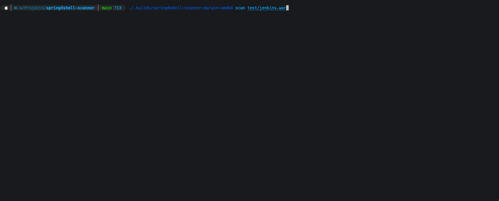

# spring4shell-scanner 

This scanner will recursively scan paths including archives for spring libraries and classes that are vulnerable to CVE-2022-22965 and CVE-2022-22963. 

Currently the allow list defines non exploitable versions, in this case spring-beans 5.3.18 and 5.2.20 and spring cloud function context 3.2.3



# Features

* scans recursively through all archives in archives in archives in archives etc
* scan for known spring libraries (sha256 hash)
* scan for CachedIntrospectionResults.class files
* fast
* show related CVE's found by version
* detects class files with different extensions (eg .ezclass)
* scans through all layers of local- and remote docker images
* *binary* versions available for Windows, Linux and MacOS


# References

| CVE | References | 
|-----|------------|
| CVE-2022-22965| https://tanzu.vmware.com/security/cve-2022-22965 |
| CVE-2022-22963| https://tanzu.vmware.com/security/cve-2022-22963 |


Links
* https://www.cyberkendra.com/2022/03/springshell-rce-0-day-vulnerability.html
* https://bugalert.org/content/notices/2022-03-29-spring.html
* https://websecured.io/blog/624411cf775ad17d72274d16/spring4shell-poc
* https://www.springcloud.io/post/2022-03/spring-0day-vulnerability


# Scanning

## Usage

### Windows
```bash
$ spring4shell-scanner.exe {target-path}
```
### Linux / OSX / FreeBSD
```bash
$ spring4shell-scanner {target-path}
```

### Docker containers

Using the tool you can now also scan containers: 


```bash
$ ./spring4shell-scanner scan-image logstash:7.16.1
```

or local images:

```bash
$ ./spring4shell-scanner scan-image --local {sha256|pattern}
$ ./spring4shell-scanner scan-image --local log4shell:latest
$ ./spring4shell-scanner scan-image --local 4949add9e671

# scan all local images
$ ./spring4shell-scanner scan-image --local 

```

## Usage

### Windows
```bash
$ spring4shell-scanner.exe patch {target-path}
```
### Linux / OSX / FreeBSD
```bash
spring4shell-scanner patch {target-path}
```

## Build from source

Requirements:
- [Go 1.16 or newer](https://golang.org/dl/)

### For development
```bash
$ git clone "https://github.com/dtact/spring4shell-scanner.git"
$ go build -o ./.builds/spring4shell-scanner ./main.go
```

# Copyright and license

Code and documentation copyright 2022 Remco Verhoef (DTACT).

Code released under the MIT license.
